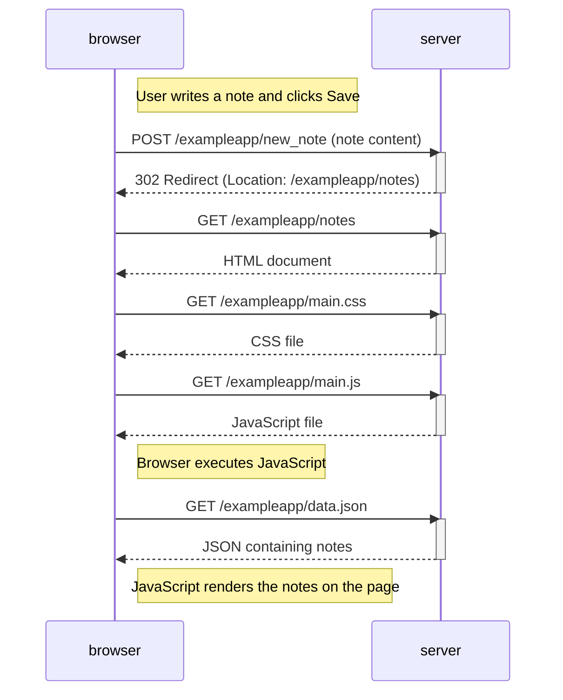

# New note diagram

```mermaid
sequenceDiagram
participant browser
participant server

    Note right of browser: User writes a note and clicks Save
    browser->>server: POST /exampleapp/new_note (note content)
    activate server
    server-->>browser: 302 Redirect (Location: /exampleapp/notes)
    deactivate server

    browser->>server: GET /exampleapp/notes
    activate server
    server-->>browser: HTML document
    deactivate server

    browser->>server: GET /exampleapp/main.css
    activate server
    server-->>browser: CSS file
    deactivate server

    browser->>server: GET /exampleapp/main.js
    activate server
    server-->>browser: JavaScript file
    deactivate server

    Note right of browser: Browser executes JavaScript

    browser->>server: GET /exampleapp/data.json
    activate server
    server-->>browser: JSON containing notes
    deactivate server

    Note right of browser: JavaScript renders the notes on the page
```
